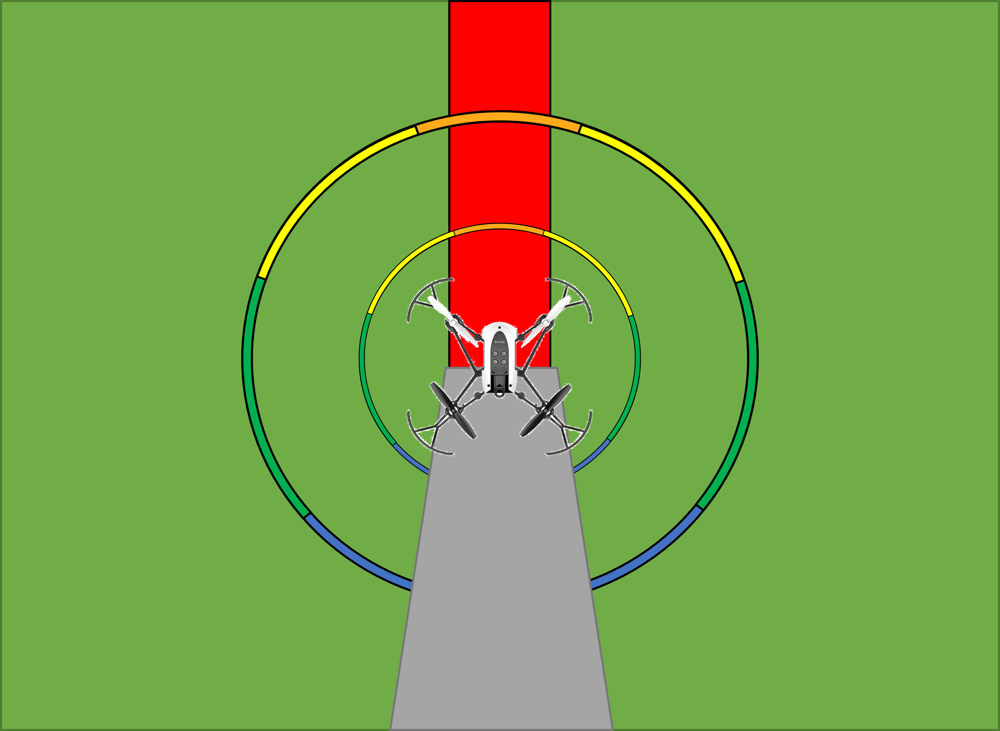
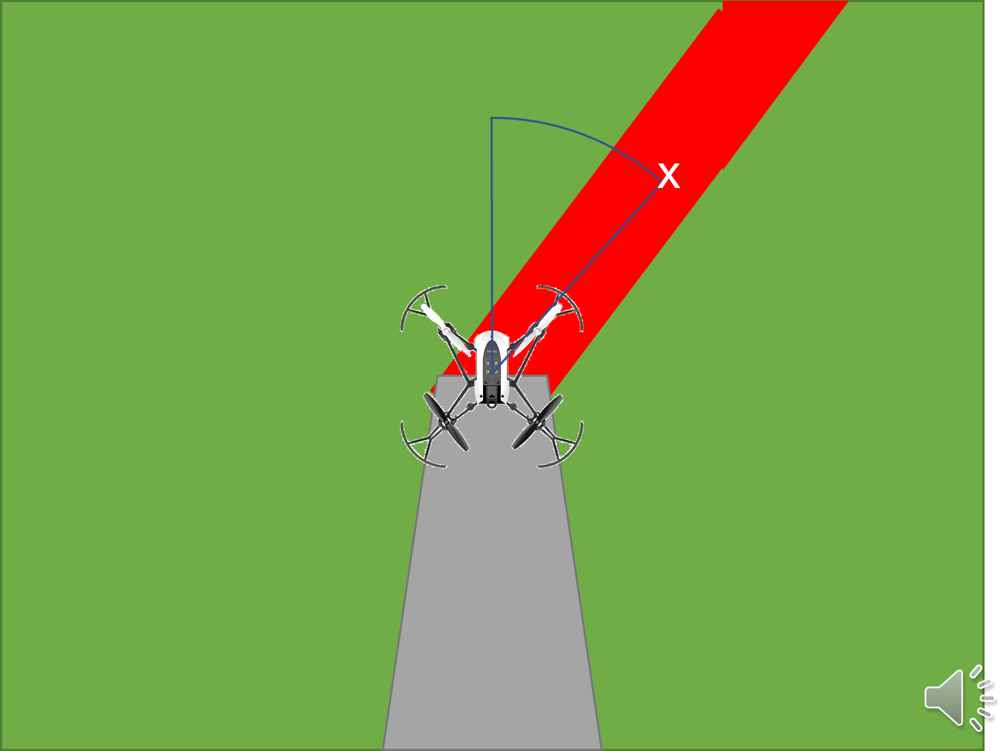
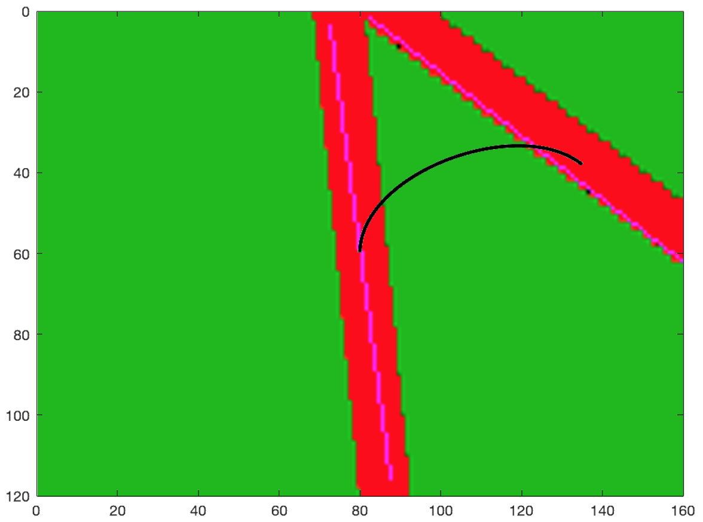
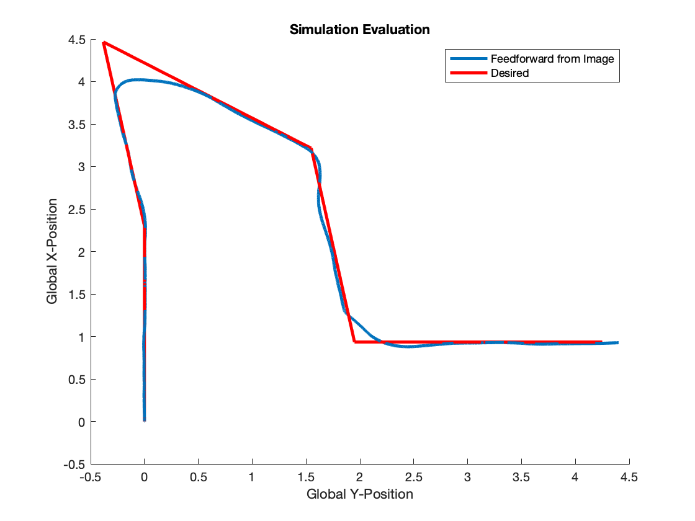

## Parrot Minidrone Competition
We investigate the problem of implementing a real-time image-based feedforward controller on a quadcopter. A method was developed with a focus on extracting a desired trajectory from the environment using an on-board camera and applying a feedforward control method to navigate a course. The image processing and controls were designed around having a distinct line to follow and a simplified dynamical model.  Through extensive simulation development our method showed promising results, while the deployment to hardware was unsuccessful due to hardware limitations. 

This project is split into two parts: The branch "HandInRound1" was the hand in for the MathWorks competition 2021, where we used a behavior-based approach.  The "main" branch contains the source code for the semester project of the course Guidance Navigation and Control, where we implemented an image-based feedforward controller.

## Motivation
This project was part of the Guidance Navigation and Control course from SDU. We decided to sign up for the Minidrone competition to get experience outside of our communication, as well as getting in contact with students outside our university.

## Results
### Matlab competition
We uploaded our final presentation 
Beside this repository, we submitted a [5 minute video](https://youtu.be/elezoPG-3co) which explains our approach, demonstrates it as well as highlithing our learnings and main challenges. The presentation can be found [here](results/MiniDroneCompetition.pdf).
Line following       |  Turning
:-------------------------:|:-------------------------:
  |  

### Guidance Navigation and Control class
Beside this repository, we submitted a [report](Results/GNC_Parrot_Minidrone.pdf), which describes the control model, detailed information about the implementation, results, discussion and conclusion. A simulation demo was published on [YouTube](https://youtu.be/kNiId2MReso).
View from drone's camera with the generated trajectory (black)       |  Desired and recorded trajectories on test track
:-------------------------:|:-------------------------:
  |  
## Credits
Thanks to the [MathWorks team](https://se.mathworks.com/academia/student-competitions/minidrones/nordics-baltics.html).

